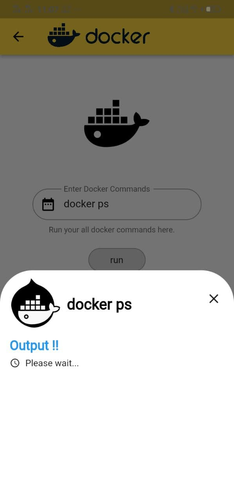
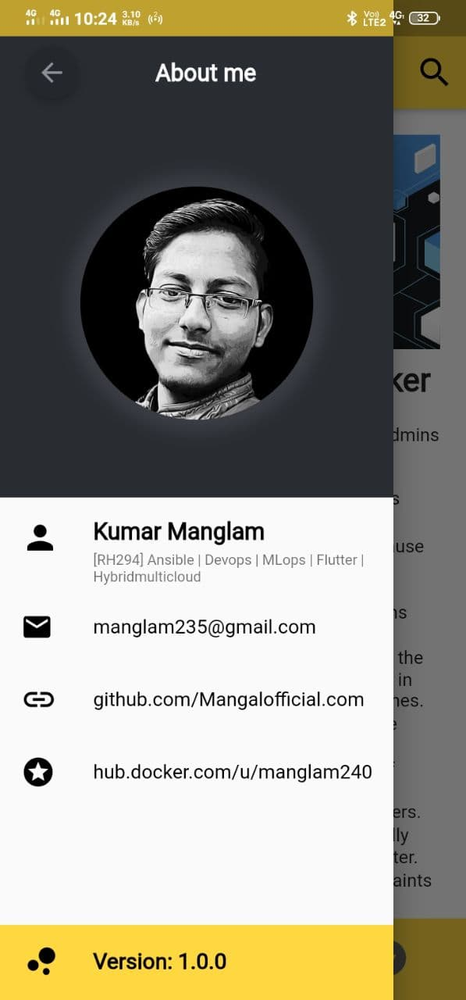

# MDoBA

A Mobile Docker Based Application [MDoBA].

## Getting Started

In this project I've created an Android application based on `Docker` that will help you to learn the basics of docker and at the same time it will also provide an interface for the handsON.
- `Landing screen`

                                                

#### This app will let you to connect to the host server where your `API (cgi-bin)` is configured and will fetch the output of the desired command.
- `API Interface`

                                                  
                                               
- `About me` 

                                                
